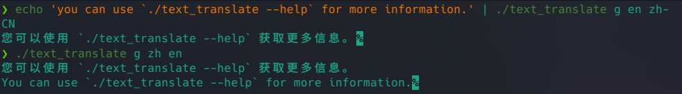
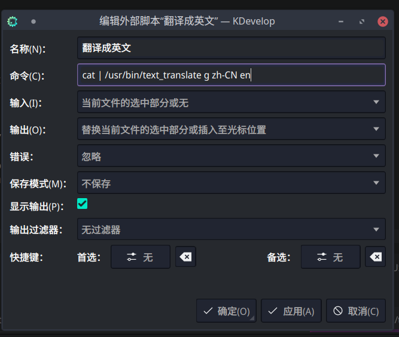

### TextTranslate

#### how to build

you can build it use cmake.
it is work well on linux.

```
git clone https://github.com/SmileYik/TextTranslate.git
cd TextTranslate
mkdir build
cd build
cmake ..
make
```

#### how to use

after you build, you will got a file named text_translate.
you can follow below instruction to translate a simple sentence.

```
./text_translate google en zh-CN you can follow below instruction to translate a simple sentence.
```

you can use `./text_translate --help` for more information.

Here's another way to use it:

```
echo 'you can use `./text_translate --help` for more information.' | ./text_translate g en zh-CN
```

or

```
./text_translate g en zh-CN
you can use `./text_translate --help` for more information.
<Ctrl+D>
```



#### use it at kdevoloper

if you use kdevoloper. you can add a external script to help
 you to translate a section text.

like this:




#### 如何编译

您可以使用 cmake 构建它。
它在 Linux 上运行良好。

```
git clone https://github.com/SmileYik/TextTranslate.git
cd TextTranslate
mkdir build
cd build
cmake ..
make
```

#### 如何使用

构建后，您将获得一个名为 text_translate 的文件。
您可以按照以下说明翻译一个简单的句子。

```
./text_translate google en zh-CN you can follow below instruction to translate a simple sentence.
```

您可以使用 `./text_translate --help` 获取更多信息。

这是另一种使用它的方法：

```
echo 'you can use `./text_translate --help` for more information.' | ./text_translate g en zh-CN
```

or

```
./text_translate g en zh-CN
you can use `./text_translate --help` for more information.
<Ctrl+D>
```


#### 在 kdevoloper 上使用它

如果你使用 kdevoloper。你可以添加一个外部脚本来帮助
 你来翻译一段文字。

像这样：


